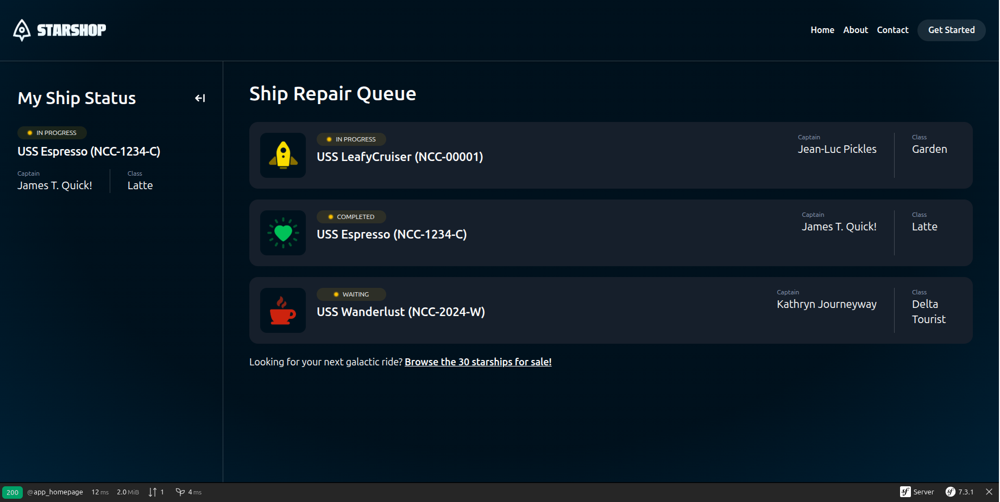

# 🚀 Starship Repair Queue - A Symfony Application

Welcome to the repository for my first project built with the Symfony framework! This is a web application that simulates a management and repair queue for starships.

This project was developed as a hands-on exercise to master the core components of Symfony. It intentionally uses an **in-memory data source** instead of a database, allowing a deep focus on Symfony's architecture, including routing, controllers, services, and the security system, without the overhead of Doctrine ORM.



---

## ✨ Key Features & Concepts Implemented

This project showcases a solid understanding of Symfony's fundamental components:

*   **Service-Oriented Architecture:** The application logic is structured around services. The `StarshipRepository`, for instance, acts as a service that provides data, currently from an in-memory array.
*   **Dependency Injection:** Key services, like the `LoggerInterface`, are injected into classes via the constructor, promoting a clean, decoupled architecture.
*   **User Authentication & Security:** A complete registration and login system is implemented using the powerful `symfony/security` component. Access control is configured to protect specific parts of the application.
*   **Routing and Controllers:** Attribute-based routing is used to map URLs to specific controller actions, keeping the application's structure clear and organized.
*   **Dynamic View Rendering with Twig:** The frontend is built with Twig, utilizing template inheritance, includes, and loops to dynamically render data provided by the controllers.
*   **PHP Enums for State Management:** The project uses native PHP Enums (`StarshipStatusEnum`) to represent the status of a starship, ensuring type-safe and readable state management.
*   **"Fake" Repository Pattern:** The `StarshipRepository` mimics the behavior of a real Doctrine repository but retrieves data from a hardcoded array. This is a common technique for prototyping and focusing on application logic.

---

## 🛠️ Tech Stack & Tools

This project was built using a modern and standard tech stack within the PHP ecosystem.

*   **Backend:**
    *   **PHP 8.2**
    *   **Symfony 7.0**PHP framework for modern web applications
*   **Data Source:**
    *   **In-Memory Array** (simulated via `StarshipRepository`)
*   **Frontend:**
    *   **Twig** Templating engine for rendering HTML
    *   **TailwindCSS** For modern and responsive styling (via Symfony's AssetMapper)
    *   **JavaScript** Optional frontend interactivity (Stimulus/Turbo)
*   **Development Tools:**
    *   **Composer** (Dependency Manager)
    *   **Git & GitHub** (Version Control)
    *   **Symfony CLI** (Development Server & Utilities)

---

## ⚙️ Local Setup and Installation

To run this project on your local environment, please follow these steps. No database setup is required!

1.  **Clone the repository:**
    ```bash
    git clone https://github.com/amarilisdev/Starships-Symfony.git
    cd Starships-Symfony
    ```

2.  **Install Composer dependencies:**
    ```bash
    composer install
    ```

3.  **Install and build frontend assets:**
    This project uses TailwindCSS. You'll need to install the Node.js dependencies and build the CSS file.
    ```bash
    npm install
    npm run build
    ```

4.  **Start the development server:**
    ```bash
    symfony serve
    ```

You're all set! The application should now be running at the address provided by the console (usually `https://127.0.0.1:8000`).

---

## 🌟 Key Learnings

This project was a fantastic exercise in understanding how Symfony works "under the hood" without the abstraction of an ORM. Key takeaways include:
*   How to structure a Symfony application around services and dependency injection.
*   The inner workings of the Security component for handling user authentication.
*   The flexibility of the framework to work with any data source, even a simple PHP array.
*   A professional development workflow using Git, Composer, and the Symfony CLI.

Thank you for visiting my project!